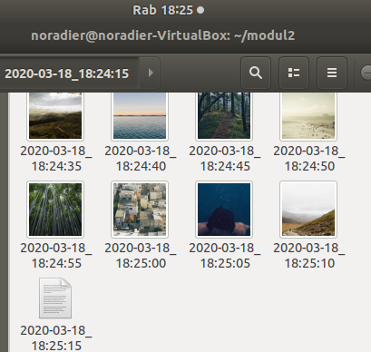
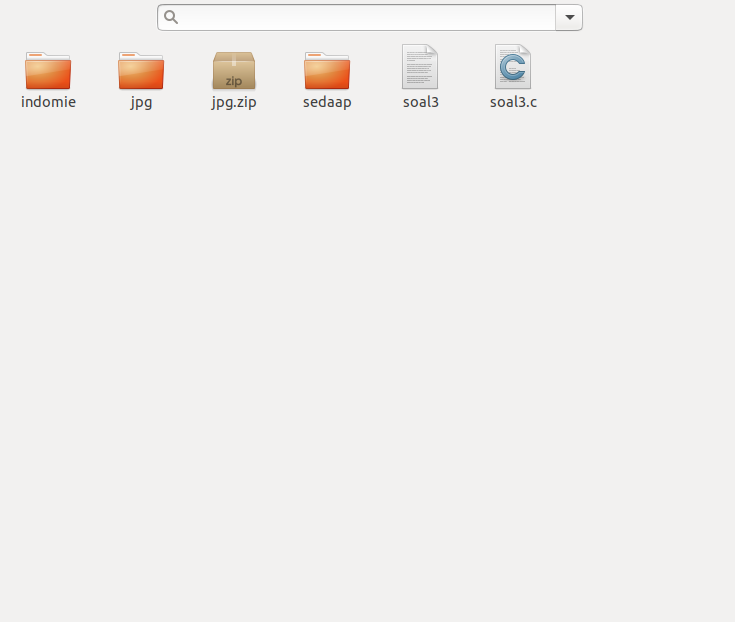

# SoalShiftSISOP20_modul2_F11

## Soal 1

### 1.a
**Soal :**
```
Program menerima 4 argumen berupa:
i. Detik: 0-59 atau * (any value)
ii. Menit: 0-59 atau * (any value)
iii. Jam: 0-23 atau * (any value)
iv. Path file .sh
```
**Jawaban :**
```c
int main(int argc, char** argv)
{
    ...
}
```
**Penjelasan :**

Semua argumen yang dituliskan di samping nama program akan disimpan di `char** argv`, termasuk nama programnya sendiri. Sedangkan `int argc` akan menyimpan jumlah argumen yang dimasukkan.

### 1.b
**Soal :**

```
Program akan mengeluarkan pesan error jika argumen yang diberikan tidak sesuai
```

**Jawaban :**
```c
//check Argument error
  if(argc != 5) //5 = program + 4 argumen lain
  {
    printf("salah woi kurang lol\n");
    return 0;
  }
```
Permisalan diatas melakukan checking apakah argumen yang dimasukkan adalah 5, sesuai dengan permintaan soal. Soal meminta 4 argumen, Karena nama program awal juga ikut masuk ke argv sebagai yang pertama, maka harus di tambahkan 1.

```c
  for (int i = 0; i < 3; i++) //check jam
  {
    //check alpha?
    for (int j = 0; j < strlen(argv[i+1]); j++)
    {
      if(strcmp(argv[i+1], "*") == 0)
      {
        continue;
      }
      else if(isdigit(argv[i+1][j]) == 0) //isdigit return 0 kalau bukan angka
      {
        //salah
        printf("arg ke %d salah alphabet\n", i+1);
        return 0;
      }
    }
    printf("arg ke %d bener angka semua\n", i+1);
    //check range
    int check = atoi(argv[i+1]); //convert ke integer
    if((i == 0 || i == 1) && (check > 59 || check < 0)) //check detik & menit
    {
      printf("arg ke %d salah range\n", i+1);
      return 0;
    }
    if(i == 2 && (check > 23 || check < 0)) //check jam
    {
      printf("arg ke %d salah range\n", i+1);
      return 0;
    } 
  }
```
Perulangan diatas digunakan untuk melakukan checking argumen detik, menit, dan jam. Perulangan bercabang diatas adalah untuk mengetahui apakah 3 argumen tersebut merupakan angka semua atau tidak, namun jika ketemu dengan "*", akan dilewati.
Lalu dibawahnya adalah pengecekan range, artinya jika tidak sesuai dengan range yang telah diberikan soal maka program akan berhenti. i==0 dan i==1 adalah untuk check detik dan menit 0-59, dan i==2 adalah check jam 0-23.

```c
  FILE *f;
  f = fopen(argv[4],"r+");
  if(f == NULL) //kalau null berarti belum ada file
  {
    printf("file tidak ada\n");
    return 0;
  }
  fclose(f);
```
Potongan program diatas adalah untuk mengetahui apakah file yang di maksud oleh argumen ke-4 itu ada. Akan dilakukan file open oleh program dan dicheck jika null maka file tersebut tidak ada dan program akan berhenti.

### 1.c
**Soal :**

```
Program hanya menerima 1 config cron
```

**Jawaban :**

Program diatas hanya bisa menerima 1 config, selain itu akan ditampilkan error dan program akan berhenti berjalan

### 1.d
**Soal :**

```
Program berjalan di background (daemon)
```

**Jawaban :**

```c
  pid_t pid, sid;
  pid = fork();

  if (pid < 0) {
    exit(EXIT_FAILURE);
  }

  if (pid > 0) {
    exit(EXIT_SUCCESS);
  }

  umask(0);

  sid = setsid();
  if (sid < 0) {
    exit(EXIT_FAILURE);
  }

  close(STDIN_FILENO);
  close(STDOUT_FILENO);
  close(STDERR_FILENO);
```
Potongan program diatas adalah cara untuk membuat daemon process.

```c
char jamWanted[5];
strcpy(jamWanted, argv[3]);
char menitWanted[5];
strcpy(menitWanted, argv[2]);
char detikWanted[5];
strcpy(detikWanted, argv[1]);
char pathFile[1000];
strcpy(pathFile, argv[4]);
```
Potongan diatas adalah untuk meng-copy argumen-argumen tersebut kedalam variabel char array / string dengan menggukan fungsi strcpy dengan header string.h.

```c
while (1) {
    bool checkJam = false, checkMenit= false, checkDetik= false;
    time_t curtime;
    struct tm *loctime;
    curtime = time (NULL);
    loctime = localtime (&curtime);

    
    char detikNow[5], menitNow[5], jamNow[5];
    sprintf(jamNow,"%d",loctime->tm_hour);
    sprintf(menitNow,"%d",loctime->tm_min);
    sprintf(detikNow,"%d", loctime->tm_sec);

    //check waktunya bener ato ga
    if(strcmp(jamWanted, "*") == 0 || strcmp(jamNow, jamWanted) == 0)
    {
        checkJam = true;
    }
    if(strcmp(menitWanted, "*") == 0 || strcmp(menitNow, menitWanted) == 0)
    {
        checkMenit = true;
    }
    if(strcmp(detikWanted, "*") == 0 || strcmp(detikNow,detikWanted) == 0)
    {
        checkDetik = true;
    }
    

    if(checkJam && checkMenit && checkDetik)
    {
      pid_t pid;
      pid = fork();
        if(pid == 0)
        {
          char *argv[] = {"bash", pathFile, NULL};
          execv("/bin/bash", argv);
        }
    }
    sleep(1);
  }
```
Potongan diatas adalah program yang akan dilooping. Pertama, program akan mendapatkan local time dari header time.h. Kemudian waktu2 itu akan dimasukkan kedalam variable string. Lalu akan dilakukan pengecekan, jika waktu yang diberikan oleh argumen dan waktu sekarang sama, atau argumen berupa "*", maka boolean akan diset menjadi true. Program bash hanya akan berjalan jika ke tiga boolean tersebut bernilai true. Jika semua boolean = true, maka program akan melakukan fork untuk spawn child yang kemudian mengeksekusi program bash dari argumen.

### 1.e
**Soal :**

```
Tidak boleh menggunakan fungsi system()
```

**Jawaban :**

Program diatas tidak menggunakan fungsi system(), hanya melakukan execv().

## Soal 2

### 2.a
**Soal :**
```
Pertama-tama, Kiwa membuat sebuah folder khusus, di dalamnya dia membuat
sebuah program C yang per 30 detik membuat sebuah folder dengan nama
timestamp [YYYY-mm-dd_HH:ii:ss].
```
**Jawaban :**
```c
while(1){
    pid_t child_id1;
    int status1;
    
    child_id1 = fork();

    char namaFolder[1000];
    snprintf(namaFolder, 1000, "./");
    getTimestamp(namaFolder);

    if(child_id1 == 0){
      pid_t child_id2;
      int status2;
      
      child_id2 = fork();

      if(child_id2 == 0){
        char *argv[] = {"mkdir", namaFolder, NULL};
        execv("/bin/mkdir", argv);
      }
    sleep(30);
  }

```
Dilakukan sebuah fork sebagai perintah utama. Perintah utama melakukan fork lagi untuk menggunakan execv memerintahkan sistem membuat direktori baru dengan timestamp waktu sekarang. Perintah utama dipanggil setiap 30 detik.

### 2.b
**Soal :**
```
Tiap-tiap folder lalu diisi dengan 20 gambar yang di download dari
https://picsum.photos/, dimana tiap gambar di download setiap 5 detik. Tiap
gambar berbentuk persegi dengan ukuran (t%1000)+100 piksel dimana t adalah
detik Epoch Unix. Gambar tersebut diberi nama dengan format timestamp [YYYY-
mm-dd_HH:ii:ss].
```
**Jawaban :**
```c
else {
        while((wait(&status2)) > 0);
        pid_t child_id3;
        int status3, i;
        char curFolder[1000]; strcpy(curFolder, namaFolder);
        char namaFile[1000];
        char linkDownload[1000];

        for(i=0; i<20; i++){
          strcpy(namaFile, curFolder); strcat(namaFile, "/");
          getTimestamp(namaFile);
          long int sec = time(NULL)%1000 + 100;
          snprintf(linkDownload, 1000, "https://picsum.photos/%ld", sec);
          child_id3 = fork();
          if(child_id3 == 0){
            char *argv[] = {"wget", "-O", namaFile, linkDownload, NULL};
            execv("/usr/bin/wget", argv);
        }
          sleep(5);
```
Parent dari perintah membuat folder kemudian akan mendownload 20 gambar dengan nama sesuai timestamp dan ukuran sesuai nilai (Epoch Unix%1000 + 100). Perintah berjalan tiap 5 detik.

### 2.c
**Soal :**
```
Agar rapi, setelah sebuah folder telah terisi oleh 20 gambar, folder akan di zip dan
folder akan di delete(sehingga hanya menyisakan .zip).
```
**Jawaban :**
```c
pid_t child_id4;
        int status4;

        child_id4 = fork();

        if(child_id4 == 0){
          char outputZip[1000];
          snprintf(outputZip, 1000, "%s.zip", curFolder);
          char *argv[] = {"zip", "-r", outputZip, curFolder, NULL};
          execv("/usr/bin/zip", argv);
        } else {
          while((wait(&status4)) > 0);
          char *argv[] = {"rm", "-r", curFolder, NULL};
          execv("/bin/rm", argv);
        }
```
Setelah mendownload 20 folder, proses selanjutnya mengubah folder menjadi zip dan folder lama dihapus.
### 2.d & e
**Soal :**
```
Karena takut program tersebut lepas kendali, Kiwa ingin program tersebut men-
generate sebuah program "killer" yang siap di run(executable) untuk
menterminasi semua operasi program tersebut. Setelah di run, program yang
menterminasi ini lalu akan mendelete dirinya sendiri.
Kiwa menambahkan bahwa program utama bisa dirun dalam dua mode, yaitu
MODE_A dan MODE_B. untuk mengaktifkan MODE_A, program harus dijalankan
dengan argumen -a. Untuk MODE_B, program harus dijalankan dengan argumen
-b. Ketika dijalankan dalam MODE_A, program utama akan langsung
menghentikan semua operasinya ketika program killer dijalankan. Untuk
MODE_B, ketika program killer dijalankan, program utama akan berhenti tapi
membiarkan proses di setiap folder yang masih berjalan sampai selesai(semua
folder terisi gambar, terzip lalu di delete).
```
**Jawaban :**
```c
void writeKillerA()
{
  FILE *temp;
  temp = fopen("killer.sh", "w");
  fputs("#!/bin/bash\n", temp);
  fputs("killOrder=$(echo $(pidof soal2))\n", temp);
  fputs("kill -9 $killOrder\n", temp);
  fputs("rm $0\n", temp);
  fclose(temp);

  pid_t tempChild_id;
  int tempStatus;
  tempChild_id = fork();

  if(tempChild_id == 0){
    char *argv[]={"chmod", "+x", "killer.sh", NULL};
    execv("/bin/chmod", argv);
  } else {

  }
}

void writeKillerB()
{
  FILE *temp;
  temp = fopen("killer.sh", "w");
  fputs("#!/bin/bash\n", temp);
  fputs("killOrder=$(echo $(pidof soal2))\n", temp);
  fputs("killOrder=${killOrder##* }\n", temp);
  fputs("kill -9 $killOrder\n", temp);
  fputs("rm $0\n", temp);
  fclose(temp);

  pid_t tempChild_id;
  int tempStatus;
  tempChild_id = fork();

  if(tempChild_id == 0){
    char *argv[]={"chmod", "+x", "killer.sh", NULL};
    execv("/bin/chmod", argv);
  } else {

  }
}
```
Program utama dapat dijalankan dengan argumen -a dan -b. Program kemudian generate sebuah program killer yang siap untuk dijalankan. Ketika dijalankan, program killer akan mengehntikan proses program utama dan menghapus dirinya sendiri. Mode -a, killer akan menghentikan semua proses dari program utama. Mode -b, killer akan menghentikan proses utama dan membiarkan proses lain bekerja sampai tugasnya selesai.

## Soal 3
### 3.a
**Soal :**
```
Program buatan jaya harus bisa membuat dua direktori di
“/home/[USER]/modul2/”. Direktori yang pertama diberi nama “indomie”, lalu
lima detik kemudian membuat direktori yang kedua bernama “sedaap”.
```
**Jawaban :**
```c
if (child_id == 0) {
    // this is child
    char *argv[] = {"mkdir", "-p", "/home/dwiki/modul2/indomie", NULL};
    execv("/bin/mkdir", argv);
  } else {
    // this is parent
    while ((wait(&status)) > 0);
    sleep(5);
    if(fork()==0)
    {
      char *argv[] = {"mkdir", "-p", "/home/dwiki/modul2/sedaap", NULL};
      execv("/bin/mkdir", argv);
    }
```
**Penjelasan :**

Potongan program diatas, setelah melakukan spawn child, dia menyuruh child tersebut untuk membuat directory "indomie" sedangkan parentnya akan menunggu child jalan, dan kemudian menunggu 5 detik. Kemudian akan spawn child lagi, yang akan melakukan pembuatan directory "sedaap".

### 3.b
**Soal :**

```
Kemudian program tersebut harus meng-ekstrak file jpg.zip di direktori
“/home/[USER]/modul2/”. Setelah tugas sebelumnya selesai, ternyata tidak
hanya itu tugasnya.
```

**Jawaban :**
```c
if(fork()==0)
{
  char *argv[] = {"unzip", "/home/dwiki/modul2/jpg.zip", NULL};
  execv("/usr/bin/unzip", argv);
}
```
Kemudian program akan melakukan fork() lagi untuk spawn child lagi, yang melakukan unzip "jpg.zip" menggunakan command unzip dari usr/bin/unzip

### 3.c
**Soal :**

```
Diberilah tugas baru yaitu setelah di ekstrak, hasil dari ekstrakan tersebut (di
dalam direktori “home/[USER]/modul2/jpg/”) harus dipindahkan sesuai dengan
pengelompokan, semua file harus dipindahkan ke
“/home/[USER]/modul2/sedaap/” dan semua direktori harus dipindahkan ke
“/home/[USER]/modul2/indomie/”.
```

**Jawaban :**
```c
    else
    {
      while ((wait(&status)) > 0);
      if(fork()==0)
      {
        char *argv[] = {"find", "/home/dwiki/modul2/jpg/.", "-maxdepth", "1", "-type", "d", "-exec", "mv", "{}", "/home/dwiki/modul2/indomie", ";", NULL};
        execv("/usr/bin/find", argv);
      }
      else
      {
        while ((wait(&status)) > 0);
        if(fork()==0)
        {
          char *argv[] = {"find", "/home/dwiki/modul2/jpg/.", "-maxdepth", "1", "-type", "f", "-exec", "mv", "{}", "/home/dwiki/modul2/sedaap", ";", NULL};
          execv("/usr/bin/find", argv);
        }
```
Selanjutnya, Program akan melakukan fork lagi untuk men-spawn child lagi, yang digunakan untuk eksekusi memindahkan semua direktori di dalam folder jpg ke folder indomie, menggunakan command find. Argumen find disini ada direktori asal, maxdepth 1(kedalaman folder, 1 berarti hanya melakukan pencarian sampai kedalaman pertama), type d(tipe file/direktori, d = direktori , f = file), exec (eksekusi command) , mv(memindahkan file/direktori), {} (file/direktori yang di find), /home/dwiki/modul2/sedaap (direktori tujuan move), dan ";" sebagai penutup. Begitu juga dengan memindahkan semua file ke dalam direktori sedaap, cara pengeksekusian programnya juga sama. Tetapi akan menunggu child sebelumnya mengeksekusi dahulu sebelum membuat child lagi.

### 3.d
**Soal :**

```
Untuk setiap direktori yang dipindahkan ke “/home/[USER]/modul2/indomie/”
harus membuat dua file kosong. File yang pertama diberi nama “coba1.txt”, lalu
3 detik kemudian membuat file bernama “coba2.txt”.
(contoh : “/home/[USER]/modul2/indomie/{nama_folder}/coba1.txt”).
```

**Jawaban :**
```c
    else
        {
          if(fork()==0)
          {
            char *argv[] = {"find", "/home/dwiki/modul2/indomie/.", "-mindepth", "1", "-type", "d", "-exec", "touch", "{}/coba1.txt", ";", NULL};
            execv("/usr/bin/find", argv);
          }
          else
          {
            while ((wait(&status)) > 0);
            sleep(3);
            char *argv[] = {"find", "/home/dwiki/modul2/indomie/.", "-mindepth", "1", "-type", "d", "-exec", "touch", "{}/coba2.txt", ";", NULL};
            execv("/usr/bin/find", argv);
          }
          
        }
```

Selanjutnya, Program akan melakukan fork lagi untuk men-spawn child lagi, yang digunakan untuk eksekusi membuat file kosong di dalam direktori yang dipindahkan sebelumnya ke folder indomie, menggunakan command find juga. Argumen find disini ada direktori asal, mindepth 1(kedalaman minimal folder, artinya hanya melakukan pencarian dari kedalaman pertama, artinya direktori yang ditunjuk / parent tidak termasuk), type d(tipe file/direktori, d = direktori , f = file), exec (eksekusi command) , touch(membuat file), {}/coba1.txt (path dan nama file yang akan dibuat), dan ";" sebagai penutup. Begitu juga dengan membuat file kosong ke dalam semua direktori yang ada di sedaap, cara pengeksekusian programnya juga sama. Tetapi akan menunggu child sebelumnya mengeksekusi dahulu sebelum membuat child lagi.

## Cara Run dan Screenshot

### nomor 1

1. compile soal1.c, dengan gcc soal1.c -o soal1
2. run program dengan ./soal1 {arg1} {arg2} {arg3} {arg4}. Contoh: ./soal1 \* \* \* /home/dwiki/prak2/realPrak2/test.sh

Penjalanan argumen yang benar akan mengeluarkan berikut:


Jika salah input akan memberitahu salah dimana:


Jika argumen kurang:


Jika memasukkan lebih dari 1 config cron:


Jika memasukkann file yang tidak ada:


awal program sebelum dieksekusi:


Karena test.sh berisi touch a.txt maka akan membuat file a.txt di direktori yang sama:


### nomor 2
1. Compile: gcc soal2.c -o soal2
2. Run dengan perintah ./soal2 lengkap dengan argumen -a atau -b.
3. Program killer dijalankan dengan perintah bash killer.sh. Perilaku program killer tergantung argumen program utama.

#### ./soal2 -a
Dijalankan dengan perintah: ./soal2 -a


Ketika dijalankan, folder baru akan dibuat dan sebuah file bash killer akan di-generate.


Untuk menjalankan program killer, tuliskan perintah pada terminal: bash killer.sh


Killer pada argumen -a akan menghentikan semua proses ./soal2 yang sedang berjalan.

Sebelum killer dijalankan:


Setelah killer dijalankan:


#### ./soal2 -b
Dijalankan dengan perintah: ./soal2 -b


Ketika dijalankan, folder baru akan dibuat dan sebuah file bash killer akan di-generate.


Untuk menjalankan program killer, tuliskan perintah pada terminal: bash killer.sh


Killer pada argumen -b hanya akan menghentikan proses ./soal2, sehingga tidak akan ada lagi folder baru yang dibuat dan folder yang tersisa akan tetap diisi 20 gambar, dibuat zip, dan dihapus folder lama.

Sebelum killer dijalankan:


Setelah killer dijalankan:





### nomor 3
1. Buat direktori modul2 di /home/{username}/
2. download jpg.zip dan soal3.c, letakkan di /home/{username}/modul2
3. compile soal3.c, dengan gcc soal3.c -o soal3
4. run program dengan ./soal3

Sewaktu program belum dijalankan:


Setelah program dijalankan maka akan membuat direktori indomie:


Setelah 5 detik akan membuat direktori sedaap dan melakukan unzip jpg.zip:


Kemudian semua direktori dipindah ke direktori indomie:


Dan semua file dipindah ke direktori sedaap:


Kemudian program akan membuat file coba1.txt disemua direktori di indomie:


3 detik kemudian membuat file coba2.txt disemua direktori di indomie:

